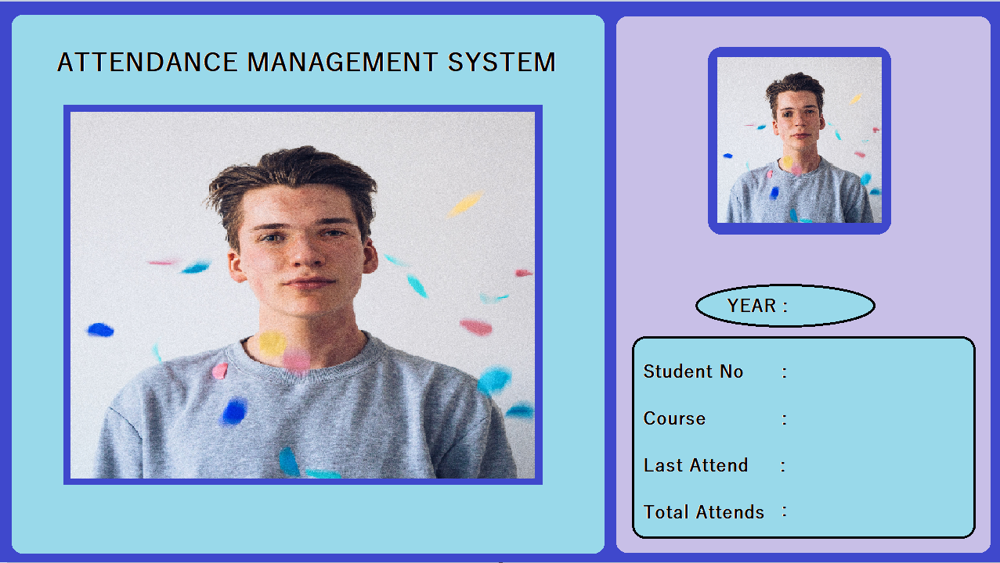

# AI-Powered Face Recognition System with Real-time Database



## Table of Contents

- [Introduction](#introduction)
- [Features](#features)
- [Requirements](#requirements)
- [Installation](#installation)
- [Usage](#usage)
- [Configuration](#configuration)
- [Contributing](#contributing)

## Introduction

Welcome to the AI-Powered Face Recognition System with Real-time Database repository. This project allows you to create an attendance marking system using computer vision and a real-time database. Users can mark their attendance by simply showing their faces to the webcam, and the system will recognize and log their attendance in a database.

## Features

- Real-time face recognition
- Attendance logging with timestamps
- Firebase real-time database integration
- Easy-to-use user interface

## Requirements

Before getting started, ensure you have the following requirements:

- Python 3.7
- OpenCV (cv2)
- cvzone
- face_recognition
- Firebase Admin SDK

## Installation

1. Clone this repository to your local machine:

   ```bash
   git clone https://github.com/PinsaraPerera/AI_powered_faceRecognition_system_with_realtime_database.git
   ```

2. Install the required Python packages:

   ```bash
   pip install opencv-python cvzone face-recognition firebase-admin
   ```

## Usage

1. Create a Firebase project and obtain the Firebase Admin SDK JSON key file.

2. Replace `serviceAccountKey.json` in the project folder with your Firebase Admin SDK JSON key.

3. Prepare 216px * 216px images of students and store them in the `Images` folder.
4. Run the application:

   ```bash
   python EncodeGenerator.py
   ```

5. Run the application:

   ```bash
   python main.py
   ```

6. Use the application to mark attendance by showing your face to the webcam.

## Configuration

You can customize the project by modifying the following parameters in the code:

- Firebase Real-time Database URL: Replace with your Firebase Database URL.
- Storage Bucket: Replace with your Firebase Storage bucket.

## Contributing

Contributions are welcome! Feel free to submit issues and pull requests to help improve this project.
